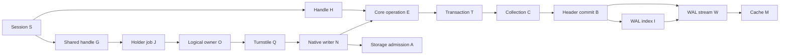
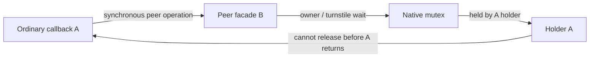
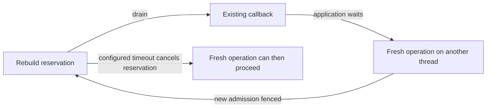

# PR #133 concurrency dependency audit

Audited baseline: `98a10086c2a296040a345e62ea987d59fc2ab487`, stacked on PR #132.
This is a source inventory and bounded-test coverage argument, not a claim of
exhaustively enumerating arbitrary application callbacks. Production code was not
changed by this audit. Findings, executable evidence and the final merge decision
are coordinated with the independent explorer, process campaign and oracle review.

## Resource vocabulary

| ID | Resource / owner | Lifetime |
| --- | --- | --- |
| S | Session admission count and close cancellation | Public call or pending begin; close waits for calls and registered handles |
| H | Handle execution owner | Exactly one public bound call; overlaps refuse rather than wait |
| D | Direct pool slot, entry/context references | Opening/closing reservation; facade, operation, reader or handle retains core |
| E | Core operation lifetime / maintenance reservation | Ordinary call or reader step; exclusive close/rebuild drains calls |
| T | Core transaction admission gate | Transaction or cursor transaction until completion; checkpoint/rebuild exclusive |
| C[n] | Collection writer ownership | Transaction snapshot, possibly multiple collection names |
| G | Shared handle admission semaphore | One local handle holder per native namespace until complete teardown |
| O | Shared logical owner gate and holder command | Facade logical thread identity/generation, possibly a separate native holder |
| Q | Native turnstile mutex | Held while waiting for N; released immediately after N acquired |
| N | Native writer mutex | Operation, ordinary mutex reader, legacy transaction, pin or explicit handle |
| P | Pin operation/hold count | Native holder cannot end until operations/holds drain, subject to force rules |
| U | Shared useLock and closingCore publication | Short metadata critical sections; closingCore can impose a drain wait |
| R | Reader leases / reader slot locks / snapshot version pins | Cursor or snapshot lifetime; external readers constrain checkpoint |
| K | Shared cached snapshot gate and coordination page write lock | Short publication/retirement sections; no coherent core retained by handle reuse |
| A | Mode admission registry, physical-file and path-family OS locks | File stream / family compatibility / replacement ownership |
| B | Header commit and header publication monitors | Serialize commit and schema/page publication |
| I | WAL index reader/writer lock | Version lookup, snapshot pinning, commit publication, checkpoint |
| W | WAL writer / stream monitor | Write, flush, checkpoint and stream finalization |
| M | Cache monitor / loading-page publication | Pinned frame ownership and wait for first loader |
| J | Worker dispatch / opened / completed events | Holder and independent close-job handshakes |

## Acquisition inventory

| Site | Resources already held | Wait / transition | Protection / remaining question |
| --- | --- | --- | --- |
| SessionLifetime.Enter / Close / TryFinish | H may precede S for bound calls; caller may own legacy N or C | S publication, cancel pending begins, drain S/handles, release facade | S monitor not held during actual release; self-close checks thread and holder dependency; cancellation must reach all native/local wait paths |
| LiteTransaction.Enter / EnterCleanup / Dispatch | S, independent caller-owned resources possible | H then S; core context and transaction binding | H overlaps reject; child misuse validates outside statement failure; close cleanup must remain idempotent |
| DirectEnginePool.Open / Entry.Release | Caller resources; global pool monitor then entry monitor | D opening/closing reservation; final core close | 5 s bound on another opener/closer; recursive same-thread open rejects; final close occurs outside pool monitors |
| OperationLifetime.Enter / Exclusive / Stop | S/H and sometimes T/C/N/R | E reservation drains active E and rebuild T; new entries queue | Current owner and continuations can drain; closing rejects fresh work; cross-thread callback work during rebuild is a candidate timeout cycle |
| TransactionMonitor.GetTransaction / release | E, sometimes N | T read before WAL ID/registration; transaction release tail before T exit | Publication after gate; disposed registration rolls back; registry close has late-publisher recovery |
| CollectionLock.TryEnter | E,T and zero or more other C locks | Wait C[n] | Same executing thread/handle owner refuses immediately; cross-collection inversion breaks at configured timeout, not global deadlock detection |
| SharedEngine.OpenTransactionResources | S; possibly callback-owned E/T/C/N/P | Guard then G; detached settings; child checkout; holder job | Same namespace executing handle and ordinary callback ownership guards; idle handle on another thread must remain waitable |
| TransactionHolder.Open / Acquire / Release | G, then O/Q/N/A; application holds H during execution | J opened; storage admitted; close event; done join; cached-wrapper publication | Native released before G and done; child/core never retained together while idle; I/O/cleanup outside begin timeout guarantee |
| WriteDatabase / StartPin | S; may be E/T/C/N inside callbacks; local leased R | Existing P or pin J -> Q -> N | Executing handle guard precedes pin selection; ordinary peer-facade callback acquisition lacks equivalent check (candidate) |
| OpenDatabase / QueryCore / EnterOwner | S; R and arbitrary caller locks possible | O -> Q -> N, then U/core open/A | Handle dependency guard covers direct, query and pin branches; same-facade foreign reader rejects; peer ordinary callback candidate remains |
| SharedMutexOwner.Enter / Send / Exit / ReleaseAll | O; send/sync monitor; N held by direct or worker owner | O semaphore; holder J; native Q/N; posted release generation | Owner recursion; exited-owner cleanup invalidates generation before release; no native release on foreign OS thread |
| SharedMutexPin.Acquire / WaitForEnd / WaitReleased | Caller R; worker Q/N; P operations or holds | J acquired/released; wait for P drain; external waiter probe | CanWaitFrom excludes owner in active pin operation; force cannot interrupt live operation; transferred core callback must be considered separately |
| CloseDatabase / CloseOwnedCores / AdmitLocked | N or owner generation; U around metadata only | Publish closingCore, drain E outside U, retire engine, release N | Reentry of closing core refuses; publication must persist until drain completes |
| Shared reader disposal / RemoveLocalReader | Reader R, possibly executing E callback on transferred thread | End cursor, snapshot, pin and optional checkpoint | Owned-snapshot self-dispose refuses; native-backed callback skips holder join/optional checkpoint; peer variants need independent coverage |
| WalIndexService.TryCheckpointCore | E; optional T exclusive, sometimes N | B -> I -> W; R scan before I | Acquires T before I; scans cross-process R before I; never infer no readers from T alone |
| TransactionService.Commit | E,T,C,N as applicable | B -> header publication / W -> I publication | Audit stream callbacks and checkpoint inverse orders, including failure cleanup |
| SharedCoordination / cached read admission | K then U, N may be absent for coherent protected readers | Register R, validate epoch/version, retain snapshot | Writer retirement occurs before U; EndWriterPressure avoids taking K under U |
| Native admission / replacement | A registry monitor and native admission mutex | Nonblocking OS region locks; bounded admission mutex; replacement transfer | File aliases require coordination family equivalence; kernel release on process death must be demonstrated |

## Cycles and required disposition

1. **Confirmed ordinary same-file peer callback:** outer facade owns N through its worker;
   its input/read callback calls an ordinary peer facade operation; peer O/Q waits
   for N; N release waits for the original callback. `ThrowIfCallbackOwnershipWait`
   currently guards handle begin, not ordinary peer calls. The independent oracle
   reviewer reproduced it on this head and the actual parent `49c327cf1` / upstream
   `dev` `5dd942a73`, plain and encrypted. It is pre-existing but remains an
   in-scope merge blocker for the requested callback-liveness contract.
2. **Maintenance + cross-thread callback:** active E callback waits synchronously
   for another thread's fresh operation; rebuild has reserved exclusive E and
   waits for that callback; fresh operation waits behind maintenance. Rebuild's
   configured deadline breaks this cycle. Classify documented contention versus
   additional rejection requirement; do not call the timeout successful prevention.
3. **Opposite collection order:** independent Direct handles hold C[a]/C[b], then
   request C[b]/C[a]. Collection timeout releases a failing handle's work; retain
   no-partial-commit and unrelated-state oracle. Global resource ordering is not
   currently guaranteed by the API.
4. **Two databases and callbacks:** A holds N[x]/C[x], B holds N[y]/C[y], and their
   callbacks synchronously request the opposite database. Local namespace guards
   cannot derive arbitrary application dependencies. Document an application-level
   ordering requirement and demonstrate supported single-direction cross-database
   calls are not blanket-rejected.

## Resource ordering and wait-for graphs

Arrows below mean "can request while retaining", not that the resource on the
left is always a monitor held across the request. Lifetime counts and native
ownership are equally important edges. In particular, returning from `BeginTrans`
does not remove its T/C/N edges, and returning a cursor does not remove its R/T
or fallback N edges.

The actual H admission briefly takes the H monitor before S; ordinary public
calls take S without H. Neither monitor is held while the public action runs.
Session close snapshots handles under S, then invokes their close requests
outside S, so the apparent S/H monitor inversion does not itself create a cycle.
Similarly, Q is released after N acquisition; native release never takes Q.
`HasWaiter` uses a zero-time probe, so N -> Q is not a blocking reverse edge.

Commit releases W before publishing to I. Checkpoint holds B then I then W.
Thus a diagram that merges successive acquisitions into simultaneous ownership
would invent a W -> I inversion on ordinary commit. Transaction-ID reservation
inside W uses `Interlocked.Increment`, not I. Fatal flush publication inside W
marks unavailable state, and physical teardown runs after W is released; see
[WAL durable flush](../../LiteDB/Engine/Disk/DiskService.WalWrite.cs) and
[durability tests](../../LiteDB.Tests/Internals/WalDurability_Tests.cs).

This second graph is the confirmed ordinary cross-facade defect, not the already
protected explicit-handle callback graph. The waiter's facade has neither the
outer facade's pin nor its core, so checking only its own `_owner`, `_pin`, or
`IsExecutingOwnedCoreOnCurrentThread` cannot find the edge.

This third graph is a documented bounded contention outcome: maintenance fences
new independent calls, and rebuild has a deadline. It is not an unbounded close
cycle. Raw close sets `_closingRequested`, wakes queued independent work and
rejects it, while allowing existing transaction/cursor continuations to drain.
The application's synchronous wait is not propagated as a transaction binding.
The existing [raw close dependency tests](../../LiteDB.Tests/Engine/TransactionHandleRawCloseDependency_Tests.cs)
exercise this distinction. The [maintenance progress tests](../../LiteDB.Tests/Engine/TransactionHandleMaintenanceProgress_Tests.cs)
assert timeout removes the reservation and existing owners can finish. No claim
is made that rebuild must succeed while an application retains a dependency it
needs to drain.

## Detailed site and transition references

This is the inventory of synchronization families in the affected lifecycle.
Each row includes acquire, publication and release/error paths; it is not merely
a list of successful public methods.

| Family | Concrete acquisition / publication / retirement sites | Boundary and invariant |
| --- | --- | --- |
| Session | [SessionLifetime](../../LiteDB/Client/Transactions/SessionLifetime.cs): `Enter`, `Register`, `Completed`, `Exit`, `Close`, `RequestClose`, `TryFinish` | S metadata is protected by `_gate`; cancellation and handle cleanup occur outside it. Close's 10 s observation deadline does not cancel admitted storage I/O. Registration after close must refuse and roll back the unpublished handle. |
| Bound ownership | [LiteTransaction](../../LiteDB/Client/Transactions/LiteTransaction.cs): `Enter`, `Exit`, `RunCore`, `Dispatch`, `EnterCleanup`, `RequestClose`, `ReleaseResources`; [bound objects](../../LiteDB/Client/Transactions/TransactionEnumerable.cs) | H owns one synchronous action, including mapping/enumeration/cleanup. Scope restoration must finish before H is published free. Completed/abandoned resources must not retain the session through a reusable worker. |
| Context | [EngineContext](../../LiteDB/Engine/EngineContext.cs), [TransactionContext](../../LiteDB/Engine/TransactionContext.cs), [core context release](../../LiteDB/Engine/Engine/Context.cs) | Reference release enters E as continuation; thread-local binding is separate from synchronous dependency. Finalizer queues abandonment instead of waiting or doing storage I/O. |
| Direct pool | [pool](../../LiteDB/Client/Direct/DirectEnginePool.cs), [lease](../../LiteDB/Client/Direct/DirectEngineLease.cs), [reader](../../LiteDB/Client/Direct/DirectEngineReader.cs) | Pool Gate -> Entry.Gate is short; final core close and pool-slot removal are separated. Reader iteration runs outside reader monitor; concurrent disposal latches closure and active Read performs cleanup. |
| Core maintenance | [OperationLifetime](../../LiteDB/Engine/Services/OperationLifetime.cs), [LiteEngine.Close](../../LiteDB/Engine/LiteEngine.cs), [Rebuild](../../LiteDB/Engine/Engine/Rebuild.cs) | E reservation prevents reader starvation, T dependencies must drain before rebuild. Close wakes C waiters before E drain. Deferred fatal close executes after the final active operation. |
| Transaction gate | [TransactionGate](../../LiteDB/Engine/Services/TransactionGate.cs), [LockService](../../LiteDB/Engine/Services/LockService.cs), [monitor](../../LiteDB/Engine/Services/TransactionMonitor.cs), [registry](../../LiteDB/Engine/Services/TransactionRegistry.cs) | Writer reservation fences fresh T readers, same owner may recurse, exclusive-under-own-T refuses. T is acquired before transaction ID and registration. Late close/publication cannot leave a slot rooted. CAS registry loops are lock-free capacity/publication loops, not blocking waits. |
| Collection locks | [CollectionLock](../../LiteDB/Engine/Services/CollectionLock.cs), [Snapshot](../../LiteDB/Engine/Services/SnapShot.cs) | T -> C; creating/upgrading snapshot acquires C before publishing it. C remains held through explicit transaction completion. Same-thread or executing-handle dependency returns immediate configured lock error; other threads may wait up to TIMEOUT. |
| Snapshot lifetime | [snapshot disposal](../../LiteDB/Engine/Services/Snapshot.Lifetime.cs), [WAL snapshot](../../LiteDB/Engine/Services/WalIndexService.Snapshot.cs), [checkpoint](../../LiteDB/Engine/Services/WalIndexService.Checkpoint.cs) | Dispose releases C and I version pin exactly once. T exclusive alone does not establish no live R snapshots; shared registry may be unknown, in which case checkpoint skips mutation. |
| Shared handle ownership | [SharedEngine.Transactions](../../LiteDB/Client/Shared/SharedEngine.Transactions.cs), [TransactionAdmission](../../LiteDB/Client/Transactions/TransactionAdmission.cs) | Guards precede G; one admission budget spans G and native polling. J opened signal publishes core only after native/storage admission. Release waits job completion, not reusable worker exit. Child is cached only after core, file handles and mode admission release. |
| Shared workers | [holder scheduler](../../LiteDB/Client/Transactions/SharedHolderScheduler.cs), [close scheduler](../../LiteDB/Client/Transactions/SessionCloseScheduler.cs), [holder context](../../LiteDB/Client/Shared/TransactionHolderContext.cs), [close dependency](../../LiteDB/Client/Transactions/SessionCloseDependency.cs) | Scheduler monitor protects idle queue/pending job only. Work frame and execution context return before idle publication. Busy worker does not prevent creating a worker for another database. Holder/cancellation callback cannot synchronously join its own session-close dependency. |
| Shared owner | [SharedMutexOwner](../../LiteDB/Client/Shared/SharedMutexOwner.cs): `Enter`, `TryEnter`, `TakeGate`, `Send`, `Post`, `Exit`, `ReleaseAll`, `ReleaseIfOwnerExited`, `ReleaseExitedOwner` | O semaphore precedes `_send` command join and Q/N. `_sync` is released before command waits. Generation invalidation precedes posted release; O reopens after native release. `TryEnter` may join its own previously posted release/owner-exit cleanup, so it is not universally nonblocking. |
| Native turnstile | [SharedMutexTurnstile](../../LiteDB/Client/Shared/SharedMutexTurnstile.cs), [SharedMutexScope](../../LiteDB/Client/Shared/SharedMutexScope.cs) | Q -> N, never N -> blocking Q on release. Windows wait-any cancellation and Unix timed native polling differ. The thread that acquired N releases it. Abandonment means ownership was acquired, not failed. |
| Pins | [SharedMutexPin](../../LiteDB/Client/Shared/SharedMutexPin.cs): `Acquire`, `MarkReady`, `TryEnter`, `ToHold`, `Exit`, `RequestRelease`, `CanWaitFrom`, `WaitForEnd`, `WaitReleased`; [SharedEngine.Readers](../../LiteDB/Client/Shared/SharedEngine.Readers.cs) | P operations and holds prevent ordinary release. Forced release ignores idle holds but never active P operations. Pin publishes only after open/count, ordered with Dispose by U. Starting pin waits existing facade mutex waiters to prevent barging. |
| Shared operation admission | [Calls](../../LiteDB/Client/Shared/SharedEngine.Calls.cs), [Waiters](../../LiteDB/Client/Shared/SharedEngine.Waiters.cs), [core open/close](../../LiteDB/Client/Shared/SharedEngine.cs), [disposal](../../LiteDB/Client/Shared/SharedEngine.Disposal.cs) | Count admitted calls only after N/disposed checks; WaitForAdmittedCalls is bounded. U is not held while E drains; core remains published for callback dependency checks. Closing error must not release N over an executing core. |
| Query ownership alternatives | [Query](../../LiteDB/Client/Shared/SharedEngine.Query.cs), [SharedDataReader](../../LiteDB/Client/Shared/SharedDataReader.cs), [Readers](../../LiteDB/Client/Shared/SharedEngine.Readers.cs) | Small result buffers; larger results lease snapshot if registry accepts; fallback / FOR UPDATE retain N. Independent leased snapshot and native-backed transferred reader require different guards. Reader Dispose admission is atomic. |
| Mapped read coordination | [CoordinatedReads](../../LiteDB/Client/Shared/SharedEngine.CoordinatedReads.cs), [Coordination](../../LiteDB/Client/Shared/SharedEngine.Coordination.cs), [coordination page](../../LiteDB/Client/Shared/SharedCoordinationPage.cs) | K snapshot gate -> R registration -> U admit, with epoch revalidation. Writer retirement takes K before U; EndWriterPressure avoids reverse U -> K. Retired cached engine closes only after cached Readers count reaches zero. Its read path has no custom ReadTransform/caller streams (`CanScope`). |
| External reader registry | [SharedReaderRegistry](../../LiteDB/Client/Shared/SharedReaderRegistry.cs), [SharedReaderSlots](../../LiteDB/Client/Shared/SharedReaderSlots.cs) | Registry gate -> slot gate; native file-sharing lease spans process lifetime/readers. Version scan happens under writer ownership but outside I. Unknown/malformed live registry prevents checkpoint, rather than inventing an empty reader set. |
| Mode admission | [SharedModeAdmission](../../LiteDB/Client/Shared/SharedModeAdmission.cs), [registry](../../LiteDB/Client/Shared/DatabaseAdmissionRegistry.cs), [file lock](../../LiteDB/Client/Shared/DatabaseFileLock.cs), [path lock](../../LiteDB/Client/Shared/DatabasePathLock.cs), [replacement](../../LiteDB/Client/Shared/DatabaseReplacementLease.cs) | Path admission mutex -> registry Gate -> identity mutex -> nonblocking OS region probes/conversions. Admission mutex is bounded at 5 s; compatibility conflicts fail closed. Replacement retains both identities and restores/retains correct family on failure. |
| Commit / WAL | [TransactionService](../../LiteDB/Engine/Services/TransactionService.cs), [WAL index](../../LiteDB/Engine/Services/WalIndexService.cs), [checkpoint](../../LiteDB/Engine/Services/WalIndexService.Checkpoint.cs), [WAL write](../../LiteDB/Engine/Disk/DiskService.WalWrite.cs) | C -> B -> W, then I after W release; checkpoint B -> I -> W. Header publication monitor is nested under B only for schema callbacks. Rollback can acquire B/W to return allocated pages, so cleanup is not a lock-free operation. |
| Cache / buffers | [MemoryCache](../../LiteDB/Engine/Disk/MemoryCache.cs), [writable cache](../../LiteDB/Engine/Disk/MemoryCache.Writable.cs), [SharedPageReads](../../LiteDB/Engine/Disk/SharedPageReads.cs) | First loader publishes Loading under M, does I/O outside M, then publishes Readable or failed/free and pulses waiters. Atomic extra-pin loops do not hold M; final release/reuse remains synchronized. A caller stream callback can introduce an application-owned reverse edge; no blanket no-reentry guarantee is inferred. |
| Stream lifetime | [StreamPool](../../LiteDB/Engine/Disk/StreamFactory/StreamPool.cs), [StreamFactory](../../LiteDB/Engine/Disk/StreamFactory/StreamFactory.cs), [ConcurrentStream](../../LiteDB/Engine/Disk/Streams/ConcurrentStream.cs), [SharedFileHandles](../../LiteDB/Engine/Disk/StreamFactory/SharedFileHandles.cs) | Lazy writer creation has runtime synchronization; publication uses a separate created-writer field before Lazy reports completion. Return/Dispose use exactly-once bag transfer. File buffers finalize before native admission release. Custom stream methods can block independently of LiteDB's lock deadlines. |

Other short monitors in this surface protect header collection dictionaries,
schema cache, diagnostics counters, checkpoint backoff and random vector-level
selection. They do not wait for an external owner or execute a production user
callback while held. File I/O, OS scheduling, runtime `Lazy<T>` initialization,
GC and user delegates can block without an explicit `Wait` call; these remain
part of the dependency model. Instrumentation hooks intentionally execute inside
some protected boundaries, but only in DEBUG/TESTING and are not evidence of a
production callback edge by themselves.

## Error and cleanup dependency audit

| Trigger | Required ordering | Existing discriminating coverage |
| --- | --- | --- |
| Begin cancelled before/after G, native acquisition or storage open | Preserve caller token; release only acquired ownership; close unpublished child before G returns; no admitted handle after session close | [admission lifetime](../../LiteDB.Tests/Engine/TransactionHandleAdmissionLifetime_Tests.cs), [admission](../../LiteDB.Tests/Engine/TransactionHandleAdmission_Tests.cs), [Shared admission](../../LiteDB.Tests/Engine/TransactionHandleSharedAdmission_Tests.cs) |
| Ordinary native waiter when session closes while legacy owner remains live | Close cancellation releases O/Q waiter so S can drain; final engine cleanup can then release legacy N | [close cleanup](../../LiteDB.Tests/Engine/TransactionHandleCloseCleanup_Tests.cs), [pin cancellation](../../LiteDB.Tests/Engine/TransactionHandleSharedPinCancellation_Tests.cs), [turnstile cancellation](../../LiteDB.Tests/Engine/TransactionHandleTurnstileCancellation_Tests.cs) |
| Input/read callback throws after writes | Roll back transaction whose statement failed; retain unrelated committed data; do not let cleanup replace original failure | [bound dispose race](../../LiteDB.Tests/Engine/TransactionHandleBoundDisposeRace_Tests.cs), [ordinary callback controls](../../LiteDB.Tests/Engine/TransactionHandleOrdinaryCallbackControl_Tests.cs), [failure tests](../../LiteDB.Tests/Engine/TransactionHandleFailure_Tests.cs) |
| Dispose races admitted bound operation or session-owned rollback | Child Dispose either belongs to admitted operation or becomes idempotent; don't release inner while operation holds it | [child close race](../../LiteDB.Tests/Engine/TransactionHandleChildCloseRace_Tests.cs), [dispose safety](../../LiteDB.Tests/Engine/TransactionHandleDisposeSafety_Tests.cs) |
| WAL I/O failure while another handle exists | Publish fatal state before allowing further writes; deferred cleanup drains E; healthy handle disposal must not repeat another owner's error | [fatal cleanup race](../../LiteDB.Tests/Engine/TransactionHandleFatalCleanupRace_Tests.cs), [dispose safety](../../LiteDB.Tests/Engine/TransactionHandleDisposeSafety_Tests.cs), [WAL durability](../../LiteDB.Tests/Internals/WalDurability_Tests.cs) |
| Last ordinary reader closes during another reader callback | Preserve U/core publication while E drains; refuse self-dependent close; do not join owner retirement from callback | [late reader close](../../LiteDB.Tests/Engine/SharedLateReaderClose_Tests.cs), [reader retirement](../../LiteDB.Tests/Engine/SharedReaderRetirement_Tests.cs), [late callback close](../../LiteDB.Tests/Engine/TransactionHandleLateCallbackClose_Tests.cs) |
| Owner thread exits while transferred reader is active | Invalidate old generation once; drain callback without releasing native ownership early; later reader cleanup cannot release new generation | [owner exit](../../LiteDB.Tests/Engine/SharedMutexOwnerExit_Tests.cs), [late reader close](../../LiteDB.Tests/Engine/SharedLateReaderClose_Tests.cs), [posted release](../../LiteDB.Tests/Engine/TransactionHandlePostedRelease_Tests.cs) |
| Child core open/close fails | Discard failed reusable wrapper; clean acquired admission/handles; preserve error and committed indexed sentinel | [child lifetime](../../LiteDB.Tests/Engine/TransactionHandleChildLifetime_Tests.cs), [Shared cleanup](../../LiteDB.Tests/Engine/TransactionHandleSharedCleanup_Tests.cs) |
| Handle/session abandoned, worker becomes idle | Native holder must not root application callback/AsyncLocal graph; finalization signals cleanup; idle worker returns work frame before publication | [abandonment](../../LiteDB.Tests/Engine/TransactionHandleAbandonment_Tests.cs), [child lifetime](../../LiteDB.Tests/Engine/TransactionHandleChildLifetime_Tests.cs), [scope retention](../../LiteDB.Tests/Engine/TransactionHandleCallbackScopeRetention_Tests.cs), [holder scheduler](../../LiteDB.Tests/Engine/TransactionHandleHolderScheduler_Tests.cs) |

## Coverage matrix and finite dispositions

"Covered" identifies an existing discriminating test, not a claim that this audit
reran it or that arbitrary combinations are proved. The orchestration report
records exact executed commits, results and added explorer/process scenarios.

| ID / blocking boundary | Held resources / competing operation | Expected behavior | Test / disposition |
| --- | --- | --- | --- |
| C01: H | Same handle call already executing, second read/write/commit or mapper reentry | Immediate overlap refusal; original operation remains valid | [binding](../../LiteDB.Tests/Engine/TransactionHandleBinding_Tests.cs), [callback handoff](../../LiteDB.Tests/Engine/TransactionHandleCallbackHandoff_Tests.cs); explorer must use genuinely overlapping actor intervals |
| C02: C[n] | Executing handle owns C[n], same-thread ordinary callback writes same collection through facade | Immediate lock error without independent work enlisting | [callback lock](../../LiteDB.Tests/Engine/TransactionHandleCallbackLock_Tests.cs) |
| C03: C[n] | Idle handle owns C[n], ordinary caller waits while different thread completes handle | Legitimate wait then progress; must not reject only because handle was created on caller thread | `Original_thread_may_wait_for_idle_handle_completed_by_another_thread` in [callback lock](../../LiteDB.Tests/Engine/TransactionHandleCallbackLock_Tests.cs) |
| C04: C[a] -> C[b] | Two independent Direct transactions take opposite collections | Bounded contention via configured lock timeout, no partial losing transaction | Feasible cycle, not unreachable. Existing timeout contract is escape; new explorer exercises acquisition orders and cold-state oracle. No blanket all-success expectation. |
| C05: E | Active read plus waiting rebuild plus fresh read | Existing read drains; new read held; rebuild progresses | [maintenance progress](../../LiteDB.Tests/Engine/TransactionHandleMaintenanceProgress_Tests.cs) |
| C06: E | Active callback waits fresh cross-thread work while rebuild waits callback | Rebuild may time out; reservation then retires and fresh work progresses | Feasible but bounded and permitted by documented maintenance fence; combined actual-engine scenario added in `TransactionHandleMaintenanceCycle_Tests` (C06/1), plus maintenance timeout component test. |
| C07: E | Same callback dependency while raw close waits callback | Fresh work refuses ENGINE_DISPOSED before callback returns | [raw close dependency](../../LiteDB.Tests/Engine/TransactionHandleRawCloseDependency_Tests.cs) |
| C08: S | Closing session, legacy Shared owner and peer native waiter | Cancel peer admission, drain, rollback/dispose legacy owner | [close cleanup](../../LiteDB.Tests/Engine/TransactionHandleCloseCleanup_Tests.cs); actual native-wait/turnstile marker required |
| C09: G / N | Executing handle callback through same or peer facade attempts ordinary same namespace op | Immediate refusal before pin/local/native acquisition; caught refusal preserves handle | [Shared callback](../../LiteDB.Tests/Engine/TransactionHandleSharedCallback_Tests.cs), [pin callback](../../LiteDB.Tests/Engine/TransactionHandleSharedPinCallback_Tests.cs) |
| C10: G / N | Ordinary active pin, FOR UPDATE or fallback reader callback begins handle, same or peer facade | Immediate refusal before local wait, including transferred reader | [ordinary callback begin](../../LiteDB.Tests/Engine/TransactionHandleOrdinaryCallbackBegin_Tests.cs), [initial query callback](../../LiteDB.Tests/Engine/TransactionHandleOrdinaryCallbackControl_Tests.cs) |
| C11: G / N | Independent leased snapshot callback begins handle; idle owner completed by peer | Valid operation progresses; dependency checks must not reject all reader callbacks | `Independent_leased_reader_callback_can_begin_handle` and idle-handle [pin callback control](../../LiteDB.Tests/Engine/TransactionHandleSharedPinCallback_Tests.cs) |
| C12: O / Q / N | Ordinary native-owning callback invokes ordinary same-file peer operation | Must not wait indefinitely on caller's own ownership | **Confirmed defect at audited head.** Missing ordinary cross-facade preflight; independent oracle report supplies pinned reproduction and negative control. Separate production correction required. |
| C13: P / J | Last-reader disposal while forced pin holder waits transferred callback | Dispose must not join that holder from dependency callback | [reader retirement](../../LiteDB.Tests/Engine/SharedReaderRetirement_Tests.cs), [late reader close](../../LiteDB.Tests/Engine/SharedLateReaderClose_Tests.cs) |
| C14: U / E | Last reader publishes closingCore while fresh operation arrives | Fresh call waits for retirement; callback self-reentry refuses; no replacement core published early | `Last_reader_close_fences_fresh_operation_until_core_retired` in [late reader close](../../LiteDB.Tests/Engine/SharedLateReaderClose_Tests.cs) |
| C15: Q / N | Competing process queued; pin wants to restart; cancel or kill waiter | No release of another owner's N; waiter eventually precedes re-pin under cooperating protocol | [turnstile cancellation](../../LiteDB.Tests/Engine/TransactionHandleTurnstileCancellation_Tests.cs), [pin progress](../../LiteDB.Tests/Engine/SharedPinProgress_Tests.cs), process campaign |
| C16: G / J publication | Complete child job, external process commits, next handle reuses wrapper | Same wrapper/worker can be reused, but N/A/core must release; reopened core observes external commit | [child reuse](../../LiteDB.Tests/Engine/TransactionHandleChildReuse_Tests.cs), [child runtime](../../LiteDB.Tests/Engine/TransactionHandleChildRuntime_Tests.cs) |
| C17: I / W | Partial checkpoint plus commit/safepoint or fatal flush | Correct ordering, no teardown under W waiting reverse I, acknowledged state preserved | [MVCC checkpoint](../../LiteDB.Tests/Internals/MvccCheckpoint_Tests.cs), [recovered commit lock](../../LiteDB.Tests/Internals/MvccRecoveredCommitLock_Tests.cs), [WAL durability](../../LiteDB.Tests/Internals/WalDurability_Tests.cs) |
| C18: K / R | Reader registers between version check and writer structural mutation | Recheck rejects stale snapshot; do not overwrite frames visible to live R | [coordination publication](../../LiteDB.Tests/Engine/SharedCoordinationPublication_Tests.cs), [WAL reuse publication](../../LiteDB.Tests/Engine/SharedWalReusePublication_Tests.cs), [slot generations](../../LiteDB.Tests/Internals/SharedSlotGenerations_Tests.cs) |
| C19: A | Same physical database via conflicting path/family or replacement | Refuse incompatible admission before writes; process death releases native ownership | [native admission](../../LiteDB.Tests/Engine/NativeAdmission_Tests.cs), process alias and crash scenarios; platform qualification remains required |
| C20: D / E | Final Direct lease closes while another facade opens / retained reader completes | Retained refs prevent premature core disposal; opener waits bounded close or receives admission conflict | Direct pool/lifetime tests and explorer close/read scenarios; no blanket assumption a disposed facade invalidates its independent reader |
| C21: M | First page loader blocked; peer waits for same Loading entry; close/failure | Loader publishes readable or failed/free, waiter wakes; cleanup must not reuse pinned frames | Memory cache loading/lifecycle and disposal regressions; arbitrary custom stream callbacks can create external cycles and are not proved safe here |
| C22: application cross-database edge | A owns database X, B owns Y, each callback synchronously requests other | Application must impose consistent ordering or use finite/cancellable admission; no global cross-database cycle detector | Feasible external protocol cycle, outside promised local dependency detection. `TransactionHandleCrossDatabaseCycle_Tests` (C22/1) forces opposed admission and cancels both, then verifies one-way other-database positive control. |

## Reproducer recipes and adversarial controls

For each test, observe an acquisition boundary, not just "started" output. A
worker that has not been scheduled can look indistinguishable from a correctly
blocked one. Expected refusal means the documented immediate exception, never
an admission or watchdog timeout.

- **C12, ordinary peer callback:** seed indexed rows and sentinel; open two Shared
  facades to one absolute file; execute lazy `InsertBulk` on A so its enumerable
  callback runs after A owns N; callback calls ordinary `Insert` on B. Observe B's
  `_mutexWaiters > 0` / contended turnstile and independently prove N exclusion.
  A remains in its callback while B cannot finish. Repeat plain/encrypted, and
  make B point at a different database as a successful control. A must not keep
  a snapshot/core after its native ownership is released. Preserve fixture and
  process history if either worker cannot terminate; never dispose a live graph
  just to clean up the test directory. The independent reviewer owns the minimal
  runnable repro and affected-base comparison.
- **C04, opposite collection order:** create both collections before transactions
  start; each actor inserts an independently modeled row, synchronize after C[a]
  and C[b] are acquired, then each requests the other's collection. Record the
  exact configured timeout error and rolled-back state. Permit either actor to
  lose; cold reopen must contain only acknowledged complete transactions and the
  untouched indexed sentinel. A scheduler-release or watchdog timeout is failure,
  not the database's expected lock-timeout outcome.
- **C06/C07, maintenance fence:** park ReadTransform while E is active, start
  rebuild or raw close, prove `_waitingExclusive` is published, then create a
  separate fresh-operation worker synchronously awaited by the callback. For
  rebuild expect its configured deadline to unwind the reservation; for close
  expect immediate ENGINE_DISPOSED in the fresh worker. Release callbacks and
  check each worker separately before cold reopen.
- **C13/C14, reader cleanup:** use a result larger than the buffering threshold,
  force reader-registry fallback or FOR UPDATE when N retention is required,
  transfer the reader, park a late transform, and trigger owner exit / last-reader
  disposal / facade close. Prove the actual core and owner remain published until
  callback return; a merely leased independent snapshot is a different scenario.
- **C15/C16, processes:** retain an admitted writer, wait for peer's actual native
  marker, kill either owner or waiter, then require survivor progress. Complete a
  durable handle, end its native ownership, let external writer commit, reuse
  wrapper, and cold reopen twice. Killed-before-confirmation and indeterminate
  confirmation cases have different allowed state sets from acknowledged commit.

False-positive controls already demanded by this surface: a different database,
a different Direct collection, an independently leased Shared snapshot, idle
handle ownership completed elsewhere, normal same-facade ordinary recursion,
restoration after nested callback exceptions, and a cancelled begin followed by a
successful retry. Each rules out a tempting but incorrect "reject everything"
fix. Alias acceptance is governed by physical-file/family admission, not by
assuming different spellings mean independent databases.

## Limits and merge decision

The confirmed C12 cycle requires a separate correction before claiming same-file
Shared callback liveness. It remains in the audited production baseline; this
report does not silently fix it or count a known-bad reproduction as a passing
regression guard. A correction should identify ordinary callback dependencies
before any O/Q/N/pin wait without forbidding supported same-facade recursion,
independent leased snapshots, idle owners or other databases.

This finite audit does not establish unrestricted linearizability, transaction-wide
snapshot isolation, fairness against noncooperating historical processes, bounded
user callbacks/custom I/O, distributed filesystem lock correctness, or arbitrary
application-created cross-database deadlock freedom. Timeout-broken cycles C04/C06
are feasible and explicitly classified, not asserted unreachable. The C04 explorer and focused C06/C22 tests record representative deterministic
schedules; they do not enumerate arbitrary user-defined callback programs.
Native OS qualification and modeled-power-loss evidence remain distinct from
actual process termination. Read-only source review is not a replacement for the
recorded execution and mutation results in the companion audit reports.

